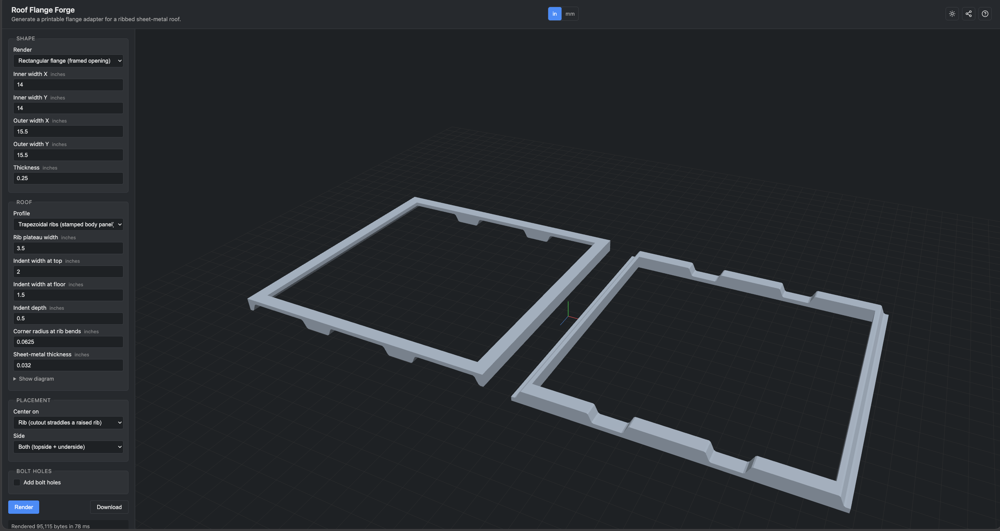

# Roof Flange Forge

Parametric flange-adapter generator for ribbed sheet-metal roofs -- van roofs,
shed roofs, RV panels, corrugated agricultural buildings. Point it at your
roof's rib profile and it produces a printable STL that bridges the ribs and
gives a fan, vent, skylight, or duct a flat, sealable base.

Runs entirely in the browser via `openscad-wasm` — no accounts, no install, no
server. Also usable from the command line if you have OpenSCAD.



## Live app

**https://acestronautical.github.io/RoofFlangeForge/** (once the first deploy runs)

## What it makes

- **Circular flange** -- round mounting ring for round-flange fittings (Maxxair
  Dome, most 6"-7" vents, roof jacks, small skylights). Choose ID / OD / ring
  thickness.
- **Rectangular flange** -- square or rectangular frame for a framed opening
  (defaults suit MaxxFan-family 14x14" fans; override inner_x/y for anything else)
  vents and similarly-shaped roof openings.
- **Roof preview** -- sheet-metal-style visualization of the roof cross-section.
  Handy for eyeballing a profile before printing anything.

Every shape has:
- **Rib-centered** or **indent-centered** placement (opening straddles a raised
  rib vs. sits over an indent).
- **Topside** (mounts above the roof, pads drop into the indents) or
  **Underside** (mounts below the roof, pockets receive the pads from above).
  Topside + underside are the two halves of a single cylinder split along the
  roof surface — they interlock with a sheet-metal gap between them.
- **Inches or millimeters** entry — the model is unit-aware.

## Directory layout

```
RoofFlangeForge/
├── cli/                       Command-line tooling
│   ├── build_stls.sh          Batch-render every variant to generated_stl/
│   └── scad/                  Parametric SCAD sources (single source of truth)
│       ├── circular_adapter.scad
│       ├── rectangular_adapter.scad
│       ├── trapezoidal_roof.scad          # roof geometry module
│       └── trapezoidal_roof_preview.scad  # thin-sheet preview
│
├── web/                       Vite + TypeScript + three.js web app
│   ├── src/
│   │   ├── main.ts            Form wiring, unit conversion, submit handler
│   │   ├── openscad-runner.ts openscad-wasm loader
│   │   ├── viewer.ts          three.js STL viewer with 1-inch grid + dims
│   │   └── style.css
│   ├── public/
│   │   ├── favicon.svg
│   │   ├── openscad/          openscad-wasm artifacts (see below)
│   │   └── scad -> ../../cli/scad   symlink; single source of truth
│   ├── index.html
│   ├── package.json
│   └── vite.config.ts
│
├── generated_stl/             Output directory for cli/build_stls.sh
│                              (empty until you run the CLI; the web app
│                              downloads STLs on the fly and doesn't touch it)
│
├── docs/
│   └── screenshot.png
│
└── .github/workflows/
    ├── pages.yml              Push to main → deploy web app to GitHub Pages
    └── build-openscad-wasm.yml   Manual dispatch → rebuild openscad-wasm main
                                    and open a PR to upgrade the vendored copy
```

## Using the web app

1. Open the live app (or `cd web && npm install && npm run dev`).
2. Pick **Inches** or **Millimeters** at the top; every field updates in place.
3. Fill in your roof numbers under **Roof** — rib width, indent widths, indent
   depth, corner radius at the rib bends, and sheet-metal thickness. Defaults
   match a 2013 Ford Transit Connect roof, but any ribbed sheet-metal profile
   in the same family works.
4. Choose the shape and set its dimensions.
5. Set placement (rib- vs. indent-centered) and side (topside/underside).
6. **Render STL** -> check the preview -> **Download STL**.

The 3D preview has a 1-inch grid (25.4 mm/cell) that scales to the loaded
model, plus a live dimensions readout, so you always see the real size of what
you're about to print.

### Practical size limits

The designs render straight through openscad-wasm's CGAL engine on the client.
Anything up to a ~30" flange with the default roof spacing renders in a couple
of seconds; larger than that, expect renders in the tens of seconds and
watch out for the browser tab running out of memory (openscad-wasm's WASM
instance is capped around ~2 GB). If you push it and get an error, drop the
OD/outer size or bump `main_thick` down and try again.

## Using the CLI

Needs local OpenSCAD (`brew install openscad` or the app at
`/Applications/OpenSCAD.app`). To batch-render every prebuilt variant:

```bash
cli/build_stls.sh
```

Outputs go to `generated_stl/`. To render a one-off variant with custom
parameters, use OpenSCAD's `-D` flag directly against any `.scad` file in
`cli/scad/`:

```bash
openscad \
    -D 'ID=6.375' \
    -D 'OD=10.5' \
    -D 'side="top"' \
    -D 'fan_offset_x=0' \
    -o my_custom_adapter.stl \
    cli/scad/circular_adapter.scad
```

Every top-level variable in the SCAD is overridable this way.

## Design notes

- The **roof** is a periodic cross-section defined by `rib_width`,
  `indent_top_w`, `indent_bot_w`, `indent_depth`, `corner_r`, and
  `sheet_thickness`. Defaults match the 2013 Ford Transit Connect roof; override
  any of them to model a different vehicle.
- The **adapter** is a ring (or rectangular frame) minus the roof cutter on the
  selected side. Topside subtraction happens *below* the roof top surface;
  underside subtraction happens *above* the roof bottom surface, offset down by
  the sheet-metal gauge. Union of the two parts fills a solid cylinder with a
  sheet-thickness slot around the physical roof.
- The **only intentional radius** in the finished part comes from the roof's
  `corner_r`, which shapes the rib-to-sidewall bend. Everything else — outer
  edges, ID, top face — stays crisp on purpose.

## Deploying

`git push` to `main` triggers `.github/workflows/pages.yml`, which:
1. `npm ci` and typechecks the web app
2. `npm run build`
3. Publishes `web/dist/` to GitHub Pages

To make sure Pages is on: **Repo Settings → Pages → Source: GitHub Actions**.

## Upgrading openscad-wasm

The vendored `openscad-wasm` under `web/public/openscad/` is the last tagged
release (2022.03.20), which is fine for these designs but predates the Manifold
boolean engine. To rebuild from openscad-wasm's `main`:

**Actions tab → "Build openscad-wasm from main" → Run workflow**

That job spins up an Ubuntu runner, runs the openscad-wasm Docker build, drops
the fresh artifacts into `web/public/openscad/`, and opens a PR. Review the PR
and merge to upgrade.

## Credits

Design lineage: inspired by [DIYvan](https://diyvan.co/)'s CNC-machined
expanded-PVC Maxxfan Dome adapter. Roof geometry was reverse-engineered from
photo measurements of a 2013 Ford Transit Connect (see git history for the full
back-and-forth); the file is general enough to model any ribbed sheet-metal
profile in that family.
